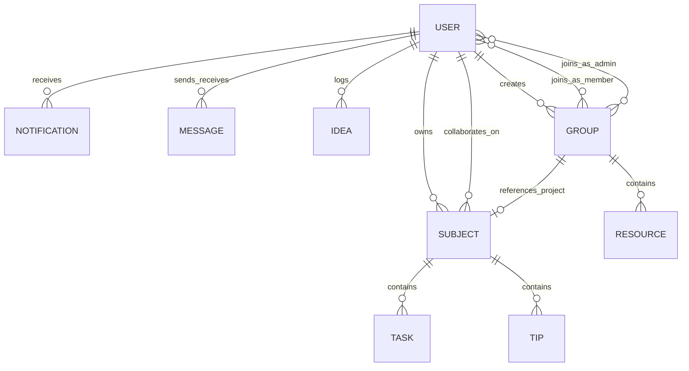

# PeerColab 🚀

PeerColab is a state-of-the-art, real-time peer-collaboration dashboard, study streak gamifier, collaborative workspace, and AI assistant built with the MERN stack (MongoDB, Express, React 19, Node.js). Designed for students, developers, and study squads, PeerColab combines collaborative task management, study groups with rich resource libraries, gamified XP progression, AI-powered idea structuring with BYOK (Bring Your Own Key), real-time chat, GitHub-style activity heatmaps, and multi-partner comparative progress reports.

---

## 🌟 Key Features

### 1. 👥 Collaborative Study Groups & Multi-Format Resource Vault
* **Project-Linked & Standalone Groups:** Create study squads connected to specific workspace subjects or standalone interest groups.
* **Granular Role & Permission Control:** Dedicated roles for Creators, Admins, and Members. Customizable group settings control who can publish resources and who can edit group information.
* **Multi-Format Resource Sharing:**
  * **Web Links:** Automatic server-side OpenGraph metadata scraping (fetches title, description, favicon, and preview thumbnail).
  * **YouTube Videos:** Auto-extracts video IDs, provides high-resolution thumbnail previews, and features an integrated in-app video player.
  * **PDF Documents:** Direct PDF file upload, storage, and one-click in-browser previewing and downloading.
  * **Contextual Annotations:** Attach personal notes and summaries to any shared resource.
* **Squad Management:** Real-time member search, invitations, member removal, and admin promotions/demotions.

### 2. 🏆 Gamification, Leveling & XP Reward System
* **Earn XP for Productivity:**
  * Standard Task Completion: **+15 XP**
  * Accepted Peer Challenge Completion: **+35 XP**
* **Dynamic Leveling Formula:** Levels are calculated using `Level = Math.floor(XP / 100) + 1` (every 100 XP unlocks a new level).
* **Level-Up Celebrations:** Milestone alerts notify users when they level up.
* **Live XP Broadcasting:** XP earnings and task completions are broadcast to study partners in real-time over WebSockets.
* **Header & Profile Badges:** Prominent XP count and Level badges displayed across navigation headers and user profiles.

### 3. 🎯 Peer Challenge & Algorithmic Recommendation Engine
* **Automated Peer Benchmarking:** Algorithmic engine monitors completed tasks across friends and classmates within shared subjects.
* **Challenge Feed:** Automatically highlights tasks that study partners have mastered: *"Your friends completed these tasks. Can you keep up?"*
* **One-Click Acceptance:** Instantly adopt a peer challenge into your workspace with a **+35 XP** bounty. Automatically creates the subject workspace if it doesn't already exist.
* **Challenge Dismissal:** Reject or dismiss suggestions with persisted preferences (`rejectedChallenges`) to keep recommendations fresh.

### 4. 💡 AI-Powered Idea Vault (Google Gemini 2.5 Flash & BYOK)
* **Automated Idea Structuring:** Converts raw thoughts and project ideas into categorized entries (Title, Project, Type, Priority, and Tags) using Google Gemini 2.5 Flash (`@google/generative-ai`).
* **AI Blueprint Expansion:** Generates comprehensive project blueprints:
  * **Problem Statement**
  * **Proposed Solution**
  * **Target Users**
  * **Expected Impact**
  * **Actionable Next Steps** (Interactive checklist)
* **Bring Your Own Key (BYOK):** Users can enter their personal Gemini API key in profile settings. Keys are encrypted using AES-256-CBC and decrypted securely only during execution.
* **Heuristic NLP Fallback:** If Gemini is offline or no key is provided, PeerColab seamlessly falls back to a smart local NLP heuristic parser without interrupting the user.
* **Search, Sort & View Modes:** Toggle between Card View and List View, with instant filtering by project, type, and priority, plus fuzzy search and date/priority sorting.

### 5. 🔗 Public Idea Sharing & WhatsApp Dispatch
* **Public Idea Blueprint Links:** Dedicated `/shared/idea/:id` web view allows sharing full idea blueprints with anyone—even users without an account.
* **One-Click WhatsApp Sharing:** Generates formatted WhatsApp messages containing idea titles, project tags, and direct web links.
* **Quick Clipboard Copy:** Copy direct shareable URLs with one click.

### 6. 📋 Collaborative Workspace & Task Management
* **Subject Boards:** Organize tasks into dedicated subject workspaces (e.g., Data Structures, Operating Systems).
* **Collaborative Sharing:** Share entire subject workspaces with classmates by username with synchronized updates.
* **Task Delegation:** Assign specific tasks to yourself or your collaborators.
* **Study Tips & Notes:** Pin and exchange study notes and tips within each subject board.
* **Progress Tracking:** Real-time visual progress bars tracking completion percentages per subject.

### 7. 💬 WhatsApp-Inspired Real-Time Peer Chat
* **Direct Messaging:** Low-latency 1-on-1 messaging powered by Socket.io.
* **Live Typing Indicators:** See when your study partner is typing in real-time.
* **Dual Message Deletion:** Soft delete for yourself (*"Delete for me"*) or revoke messages for both parties (*"Delete for everyone"*).
* **Recent Chats & Search:** Search conversations and preview the last message snippet and timestamp directly from the chat sidebar.
* **Integrated Emoji Picker:** Quick emoji picker for expressive communication.

### 8. 📊 User Profiles & Multi-Partner Comparative Excel Exports
* **Portfolio Workspace:** Dedicated profile view displaying total completed tasks, current study streak, active subjects, and connected partners.
* **Individual Excel Export:** Download personal study schedules and task histories formatted as styled `.xlsx` spreadsheets via ExcelJS.
* **Multi-Partner Comparative Excel Export:** Select multiple friends and compile an executive multi-tab spreadsheet comparing task completion status, timestamps, and subjects side-by-side.
* **Gemini Secret Key Management:** Configure, inspect masked status, or delete your encrypted Gemini API key directly from your profile.

### 9. 🔥 GitHub-Style Activity Heatmap & Productivity Streaks
* **53-Week Calendar Grid:** Visualizes task completion density across a full 53-week GitHub-style contribution calendar.
* **Streak Tracking:** Real-time tracking of current daily streak, longest streak, active study days, and single-day personal bests.
* **Interactive Tooltips:** Hover or tap on any calendar cell to inspect exact completion counts and timestamps.

### 10. ⚡ Live Activity Feed & Study Partner Network
* **Dual-View Activity Stream:** Toggle between **Live (24h)** for recent accomplishments and **History** for past milestones.
* **Direct Profile Access:** Click any friend's username in the feed to open their profile modal and inspect their accomplishments.
* **Partner Discovery:** Search users by username with instant dropdown results, send friend requests, and inspect your network tag cloud.

### 11. 🔔 Progressive Web App (PWA) & Web Push Notifications
* **PWA Enabled:** Fully installable on Desktop, Android, and iOS devices with custom manifest and service worker caching.
* **Web Push Notifications:** Native push alerts using the Web Push API (`web-push`) waking up desktop/mobile devices.
* **Duo-Style Inactivity Monitor:** Background worker checks user activity hourly. If inactive for > 24 hours, it dispatches an encouraging push alert to keep study streaks alive.
* **In-App Notification Center:** Dropdown bell with unread counters, category filtering, mark-as-read, and bulk deletion.

### 12. 💬 Daily Motivation Banner & Neobrutalist UI
* **Daily Motivational Quotes:** Date-synchronized developer and student quotes rotating daily on the workspace banner (`/api/quotes/daily`).
* **Modern Neobrutalism Design:** High-contrast aesthetic featuring bold borders (`3px solid #000`), hard drop shadows (`3px 3px 0px #000`), vibrant accent colors, and animated floating backgrounds.
* **Interactive Landing Page:** Live interactive preview showcasing mock workspaces, idea vault, chat, and heatmap before login.

---

## 🛠️ Technology Stack

| Layer | Technologies Used |
| :--- | :--- |
| **Frontend Framework** | React 19, Vite 8, React Compiler (`babel-plugin-react-compiler`) |
| **Styling & Design** | Vanilla CSS (Modern Neobrutalism System, CSS variables, glassmorphism, responsive drawer navigation) |
| **Icons & Media** | Lucide React |
| **Real-Time WebSockets** | Socket.io Client (`socket.io-client` v4.8) |
| **HTTP Client** | Axios (`axios` v1.16) |
| **Spreadsheet Engine** | ExcelJS (`exceljs` v4.4) |
| **Backend Runtime** | Node.js, Express 5 (`express` v5.2) |
| **Database & ODM** | MongoDB, Mongoose 9 (`mongoose` v9.6) |
| **Authentication & Security** | JSON Web Tokens (JWT), bcryptjs, AES-256-CBC Encryption (`crypto`) |
| **AI Integration** | Google Gemini API (`@google/generative-ai` v0.24, model `gemini-2.5-flash`) |
| **Push Notifications** | Web Push API (`web-push` v3.6), Service Workers (`sw.js`) |
| **Web Scraping & Previews** | Axios & Regular Expressions for OpenGraph/HTML metadata parsing |

---

## 📂 Project Structure

```text
peercolab/
├── backend/
│   ├── cleanup.js              # CLI Database maintenance and reset utility
│   ├── server.js               # Express 5 server, HTTP server & Socket.io setup
│   ├── config/
│   │   ├── db.js               # MongoDB connection handler
│   │   ├── selfPing.js         # Keep-alive background worker preventing cloud sleep
│   │   └── webPush.js          # Web Push VAPID configuration
│   ├── models/
│   │   ├── Group.js            # Study Group & Resource subdocument schema
│   │   ├── Idea.js             # Idea Vault schema (with AI expansion blueprint)
│   │   ├── Message.js          # Direct chat message schema with soft-deletion flags
│   │   ├── Notification.js     # Notification schema with automated push hook
│   │   ├── Subject.js          # Subject workspace, task subdocument & tips schema
│   │   └── User.js             # User schema (credentials, XP, level, secret keys, push subs)
│   ├── routes/
│   │   ├── chat.js             # Chat history and message deletion endpoints
│   │   ├── groups.js           # Study groups, members, roles, links & PDF uploads
│   │   ├── ideas.js            # Idea Vault CRUD, Gemini AI extraction & blueprint expansion
│   │   ├── notifications.js    # Notification inbox, push subscriptions & read status
│   │   ├── quotes.js           # Daily calendar-synced motivational quotes
│   │   ├── subjects.js         # Workspaces, tasks, XP rewards, sharing & tips
│   │   └── users.js            # Auth, profiles, friends, feed, peer challenges & BYOK keys
│   └── utils/
│       └── crypto.js           # AES-256-CBC encryption and decryption helpers
├── frontend/
│   ├── index.html              # HTML5 entry point with PWA manifest link
│   ├── vite.config.js          # Vite configuration
│   ├── public/
│   │   ├── manifest.json       # PWA Web App Manifest
│   │   └── sw.js               # Service Worker for push notifications & caching
│   └── src/
│       ├── App.jsx             # Main application shell, state hub & layout router
│       ├── App.css             # Neobrutalist design system styles & animations
│       ├── index.css           # Global typography & root CSS variables
│       ├── main.jsx            # React root mount
│       ├── config.js           # Base API URL configuration
│       ├── components/
│       │   ├── ActivityHeatmap.jsx   # 53-week GitHub-style activity contribution grid
│       │   ├── Auth.jsx              # Login and Registration interface
│       │   ├── BackgroundAnimation.jsx # Floating geometric background elements
│       │   ├── FriendFeed.jsx        # Real-time partner completion stream
│       │   ├── FriendManager.jsx     # User search and study partner management
│       │   ├── Groups.jsx            # Study Groups hub, resource manager & PDF viewer
│       │   ├── IdeaVault.jsx         # Idea capture, filter/search & Gemini blueprint drawer
│       │   ├── LandingPage.jsx       # Interactive Neobrutalist product showcase
│       │   ├── NotificationBell.jsx  # Notification dropdown with desktop notification support
│       │   ├── Recommendations.jsx   # Peer challenge recommendation cards
│       │   ├── SharedIdea.jsx        # Public stand-alone idea blueprint preview page
│       │   ├── SubjectWorkspace.jsx  # Subject boards, task checklists & tips
│       │   ├── TeamChat.jsx          # WhatsApp-inspired 1-on-1 real-time chat
│       │   └── UserProfile.jsx       # User stats, BYOK settings & multi-user Excel export
│       └── utils/
│           └── pushSubscription.js  # Service worker & VAPID push registration helper
├── uploads/                    # Uploaded study group files and PDF documents
└── vercel.json                 # Vercel SPA routing rewrites configuration
```

---

## 🗄️ Database Schema & Data Models

PeerColab leverages MongoDB with relations managed through Mongoose:



### Schemas Overview
1. **User (`User.js`):** Stores username, email, password hash, friends references, push subscriptions, encrypted `geminiApiKey`, presence (`lastActive`), `xp` points, `level` rank, and `rejectedChallenges` history.
2. **Subject (`Subject.js`):** Workspace boards with owner and collaborator references. Contains subdocuments for tasks (`title`, `isCompleted`, `isChallenge`, `completedAt`, `assignedTo`) and tips (`content`, `createdAt`).
3. **Group (`Group.js`):** Study squads with creator, admins list, members list, optional linked subject, and permission settings (`whoCanAddResources`, `whoCanEditInfo`). Contains `ResourceSchema` subdocuments (`title`, `type` [link/youtube/pdf], `url`, `notes`, `previewData`, `uploadedBy`).
4. **Idea (`Idea.js`):** Idea Vault entries with content, auto-extracted tags, project, type, priority, favorite status, and `aiExpanded` blueprint JSON.
5. **Message (`Message.js`):** Real-time chat messages with sender, recipient, content, and soft-delete flags (`isDeletedForEveryone`, `deletedForUsers`).
6. **Notification (`Notification.js`):** In-app alert notifications. Includes a Mongoose `post('save')` hook that automatically converts notifications into web push payloads.

---

## 📡 API Endpoints

### 👥 Collaborative Study Groups (`/api/groups`)
* `GET /api/groups/user/:userId` - Get all groups the user belongs to (as creator, admin, or member).
* `GET /api/groups/:id` - Fetch detailed group data with populated members and resources.
* `POST /api/groups` - Create a new study group (with optional linked subject).
* `PUT /api/groups/:id` - Update group name, description, and permission settings.
* `POST /api/groups/:id/members` - Add a member to the group by username.
* `DELETE /api/groups/:id/members/:targetUserId` - Remove a member or leave the group.
* `PUT /api/groups/:id/admins` - Promote or demote a group member to/from admin.
* `POST /api/groups/:id/resources` - Add a link or YouTube resource (with automatic OpenGraph scraping).
* `POST /api/groups/:id/resources/upload-pdf` - Upload and attach a PDF document.
* `DELETE /api/groups/:id/resources/:resourceId` - Remove a resource from the group vault.
* `DELETE /api/groups/:id` - Delete an entire group (creator only).

### 🔑 Authentication & Users (`/api/users`)
* `POST /api/users/register` - Create a new user account.
* `POST /api/users/login` - Authenticate user and receive JWT.
* `GET /api/users/search` - Search users by username.
* `GET /api/users/:userId/friends` - List user's study partners.
* `POST /api/users/:userId/add-friend` - Connect with a new study partner.
* `GET /api/users/:userId/recommendations` - Get peer challenge recommendations from partner completions.
* `POST /api/users/:userId/challenges/reject` - Dismiss a peer challenge suggestion.
* `GET /api/users/:userId/profile` - Fetch user statistics, streak, level, and subjects.
* `GET /api/users/:userId/feed` - Get partner activity feed (24h live and historical).
* `GET /api/users/:userId/secret-key` - Check if user has an encrypted Gemini API key saved.
* `POST /api/users/:userId/secret-key` - Encrypt and save user's custom Gemini API key.
* `DELETE /api/users/:userId/secret-key` - Remove user's saved Gemini API key.

### 📋 Workspaces & Tasks (`/api/subjects`)
* `POST /api/subjects` - Create a new subject board.
* `DELETE /api/subjects/:subjectId` - Delete a subject board.
* `GET /api/subjects/user/:userId` - Fetch all subjects owned by or shared with a user.
* `POST /api/subjects/:subjectId/tasks` - Add a task (supports `isChallenge: true`).
* `PUT /api/subjects/:subjectId/tasks/:taskId` - Mark a task as completed (awards **+15 XP** or **+35 XP**, handles level up).
* `DELETE /api/subjects/:subjectId/tasks/:taskId` - Delete a task.
* `POST /api/subjects/:subjectId/share` - Share subject board with another classmate.
* `PUT /api/subjects/:subjectId/tasks/:taskId/assign` - Assign a task to a collaborator.
* `POST /api/subjects/:subjectId/tips` - Add study tips/notes to a subject.

### 💡 Idea Vault (`/api/ideas`)
* `POST /api/ideas` - Save a new idea (extracts metadata via Gemini 2.5 Flash or heuristic fallback).
* `GET /api/ideas/user/:userId` - Retrieve all ideas for a user.
* `GET /api/ideas/:ideaId` - Public endpoint to retrieve details of a single idea.
* `PUT /api/ideas/:ideaId/favorite` - Toggle favorite bookmark status.
* `DELETE /api/ideas/:ideaId` - Delete an idea.
* `POST /api/ideas/:ideaId/expand` - Generate comprehensive AI expansion blueprint.

### 💬 Real-Time Chat (`/api/chat`)
* `GET /api/chat/history/:userId/:friendId` - Fetch 1-on-1 message history between two users.
* `PUT /api/chat/message/:messageId/delete-me` - Soft-delete message from sender's view.
* `PUT /api/chat/message/:messageId/delete-everyone` - Revoke message for everyone.

### 🔔 Notifications (`/api/notifications`)
* `GET /api/notifications/:userId` - Fetch notifications for a user.
* `POST /api/notifications` - Create a new notification.
* `PUT /api/notifications/:notificationId/read` - Mark a specific alert as read.
* `PUT /api/notifications/user/:userId/read-all` - Mark all notifications as read.
* `DELETE /api/notifications/:notificationId` - Delete a notification.
* `POST /api/notifications/subscribe` - Register a Web Push subscription object.

### 📜 Daily Motivation (`/api/quotes`)
* `GET /api/quotes/daily` - Retrieve the calendar date-synced quote of the day.

---

## ⚙️ Environment Configuration

### Backend Environment (`backend/.env`)
Create a `.env` file in the `backend` folder:
```env
PORT=5000
MONGO_URI=mongodb+srv://<username>:<password>@cluster.mongodb.net/peercolab
JWT_SECRET=your_jwt_secret_key_here
FRONTEND_URL=http://localhost:5173

# Optional: Global fallback Gemini API Key (Users can also provide their own BYOK)
GEMINI_API_KEY=your_global_fallback_gemini_api_key

# Web Push VAPID Keys (generate with: npx web-push generate-vapid-keys)
VAPID_SUBJECT=mailto:support@peercolab.com
VAPID_PUBLIC_KEY=your_vapid_public_key
VAPID_PRIVATE_KEY=your_vapid_private_key

# Optional: Self-ping to prevent free Render/cloud instances from sleeping
RENDER_EXTERNAL_URL=https://peercolab-backend.onrender.com
```

### Frontend Environment (`frontend/.env`)
Create a `.env` file in the `frontend` folder:
```env
VITE_API_URL=http://localhost:5000
VITE_VAPID_PUBLIC_KEY=your_vapid_public_key
```

---

## 🚀 Installation & Local Development

### 1. Prerequisites
Ensure you have [Node.js](https://nodejs.org) (v18 or higher) and [MongoDB](https://www.mongodb.com) installed and running locally or have a MongoDB Atlas connection string.

### 2. Backend Setup
1. Open a terminal and navigate to the backend directory:
   ```bash
   cd backend
   ```
2. Install dependencies:
   ```bash
   npm install
   ```
3. Set up your `.env` configuration file.
4. Start the backend development server:
   ```bash
   npm run dev
   ```
   *The backend will run on `http://localhost:5000`.*

### 3. Frontend Setup
1. Open a new terminal and navigate to the frontend directory:
   ```bash
   cd frontend
   ```
2. Install dependencies:
   ```bash
   npm install
   ```
3. Set up your `.env` configuration file.
4. Start the Vite React development server:
   ```bash
   npm run dev
   ```
   *The frontend will run on `http://localhost:5173`.*

---

## 🧹 Database Maintenance (Cleanup Script)

The backend provides a command-line utility to inspect, clean up, or purge database entries during testing:

```bash
cd backend

# View cleanup utility usage instructions
node cleanup.js

# Delete a specific test user and all their associated subjects, tasks, messages, and groups
node cleanup.js --user <username>

# Clear all database documents (destructive reset)
node cleanup.js --all
```

---

## 🌐 Production & Keep-Alive Features
* **Cloud Keep-Alive (Self-Ping):** The backend includes an automated worker that pings itself at `/api/status` every 14 minutes, preventing free cloud hosting (e.g., Render) from spinning down or cold starting.
* **SPA Routing Fallback:** Includes `vercel.json` rewrites to ensure clean client-side routing for public routes like `/shared/idea/:id`.
* **PWA Service Worker:** Registered client-side in `frontend/public/sw.js` for background web push alerts, desktop notifications, and asset caching.
