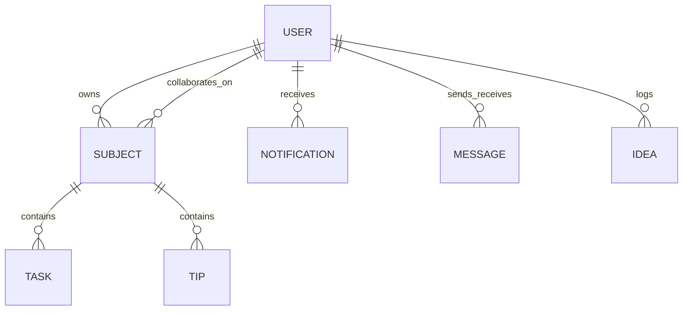

# PeerColab 🚀

PeerColab is a state-of-the-art, real-time peer-collaboration dashboard, study streak gamifier, collaborative workspace, and AI assistant built with the MERN stack (MongoDB, Express, React, Node.js). It is designed to help students, developers, and teams study together, coordinate tasks, log ideas with generative AI, track productivity streaks, chat in real-time, and view their contributions via GitHub-style heatmaps.

---

## 🌟 Key Features

### 1. 📋 Collaborative Workspace
* **Subject & Task Management:** Create workspace boards for specific study subjects. Add, edit, delete, and check off tasks.
* **Classmate Sharing:** Share entire subjects with classmates/collaborators (by username). Changes sync dynamically.
* **Task Assignment:** Assign specific tasks to yourself or your collaborators.
* **Exporting Schedules:** Export study schedules and task lists directly to Excel format (`.xlsx`) using ExcelJS for offline tracking.
* **Study Tips:** Upload and share notes or study tips within each subject workspace.

### 2. 💬 WhatsApp-Inspired Live Chat
* **Real-time Messaging:** Direct peer-to-peer messaging powered by Socket.io.
* **Typing Indicators:** See when your partner is typing in real-time.
* **Message Retention & Deletion:** Delete messages for "self" or "everyone" (revocation).
* **Notification Integration:** System automatically dispatches in-app and push notifications when messages are received while offline or browsing other tabs.

### 3. 💡 AI-Powered Idea Vault
* **Gemini Integration:** Connects with the Google Gemini API (`gemini-2.5-flash`) to store, categorize, and expand ideas.
* **Automated Idea Expansion:** AI automatically populates:
  * Problem Statement
  * Proposed Solution
  * Target Users
  * Expected Impact
  * Next Steps (Actionable list)
* **Custom Keys:** Users can set their own encrypted Gemini API Key in their profile settings, which is decrypted securely in the backend only during execution. Fallback is handled using system keys and local heuristics.

### 4. 🔥 Activity Heatmap & Streaks
* **GitHub-Style Contribution Grid:** Visualizes study task completion density across a calendar grid.
* **Study Streak Stats:** Tracks consecutive active study days.
* **Live Partners Feed:** Real-time activity timeline feed tracking what friends have accomplished.

### 5. 🔔 Progressive Web App & Push Notifications
* **PWA Capability:** Installable on Desktop, Android, and iOS devices with a custom manifest and local caching.
* **Web Push Notifications:** Native mobile/desktop push alerts using the Web Push API (`web-push` npm package) to wake up/warn users.
* **Duo-Style Inactivity Warns:** A background worker runs every hour checking user active states. If a user is inactive for > 24 hours, it dispatches a push notification: *"🔥 Keep your study streak alive! You haven't checked in for 24 hours. Let's finish some tasks today!"*

---

## 🛠️ Technology Stack

| Layer | Technologies Used |
| :--- | :--- |
| **Frontend** | React 19, Vite 8, Socket.io Client, Axios, ExcelJS, Lucide Icons, Vanilla CSS |
| **Backend** | Node.js, Express 5, Socket.io, MongoDB, Mongoose 9, Web-Push, JSON Web Tokens (JWT) |
| **AI Integration** | Google Gemini API (`@google/generative-ai`) |
| **Caching/PWA** | Service Workers (`sw.js`), Manifest API |

---

## 📂 Project Structure

```text
peercolab/
├── backend/
│   ├── cleanup.js          # CLI Database maintenance utility
│   ├── server.js           # Express server & Socket.io implementation
│   ├── config/             # DB, self-ping, and web-push configurations
│   ├── models/             # Mongoose Schemas (User, Subject, Notification, Message, Idea)
│   ├── routes/             # Express API Endpoints
│   └── utils/              # Helper utilities (encryption/decryption)
└── frontend/
    ├── index.html
    ├── vite.config.js
    ├── public/             # PWA resources, manifest.json, sw.js
    └── src/
        ├── App.jsx         # App router & layout template
        ├── main.jsx
        ├── components/     # UI Components (UserProfile, TeamChat, SubjectWorkspace, etc.)
        └── utils/          # Client-side helpers (pushSubscription registration)
```

---

## 🗄️ Database Schema & Data Models

PeerColab leverages MongoDB with relations managed through Mongoose:



### Schemas Info
1. **User (`User.js`):** Stores credentials, credentials encryption, friends array, VAPID push subscriptions, encrypted `geminiApiKey`, and presence tracker (`lastActive`).
2. **Subject (`Subject.js`):** Contains workspace properties, collaborators references, subdocument arrays for tasks (title, status, assignee) and tips.
3. **Notification (`Notification.js`):** Model for in-app alert tracking. Features a `post('save')` hook that automatically converts the notification into a web push payload and dispatches it.
4. **Message (`Message.js`):** Stores real-time chat data, including soft delete flags (`isDeletedForEveryone`, `deletedForUsers`).
5. **Idea (`Idea.js`):** Stores vault concepts, metadata, priorities, tags, and AI-expanded JSON fields.

---

## 📡 API Endpoints

### 🔑 Authentication & Users (`/api/users`)
* `POST /api/users/register` - Create a new user account.
* `POST /api/users/login` - Authenticate user and receive JWT.
* `GET /api/users/search` - Search users by username.
* `GET /api/users/:userId/friends` - List user's study partners.
* `POST /api/users/:userId/add-friend` - Send/accept friend request.
* `GET /api/users/:userId/feed` - Get unified activity feed of study partners.
* `GET /api/users/:userId/profile` - Fetch profile metadata, streaks, and heatmap data.
* `POST /api/users/:userId/secret-key` - Save encrypted Gemini API key.
* `DELETE /api/users/:userId/secret-key` - Remove stored Gemini API key.

### 📋 Workspaces & Tasks (`/api/subjects`)
* `POST /api/subjects` - Create a new subject.
* `DELETE /api/subjects/:subjectId` - Delete a subject workspace.
* `GET /api/subjects/user/:userId` - Fetch all subjects owned by or shared with a user.
* `POST /api/subjects/:subjectId/tasks` - Add a task to a subject.
* `PUT /api/subjects/:subjectId/tasks/:taskId` - Mark a task as completed.
* `DELETE /api/subjects/:subjectId/tasks/:taskId` - Remove a task.
* `POST /api/subjects/:subjectId/share` - Share workspace with another classmate.
* `PUT /api/subjects/:subjectId/tasks/:taskId/assign` - Assign task to classmate.
* `POST /api/subjects/:subjectId/tips` - Add study tip content.

### 💬 Real-Time Chat (`/api/chat`)
* `GET /api/chat/history/:userId/:friendId` - Fetch message history between two users.
* `PUT /api/chat/message/:messageId/delete-me` - Hide message from sender's view.
* `PUT /api/chat/message/:messageId/delete-everyone` - Revoke message for everyone.

### 💡 Idea Vault (`/api/ideas`)
* `POST /api/ideas` - Save a new idea (automatically extracts content via Gemini if available).
* `GET /api/ideas/user/:userId` - Retrieve all saved ideas.
* `PUT /api/ideas/:ideaId/favorite` - Toggle favorite status.
* `POST /api/ideas/:ideaId/expand` - Trigger Gemini AI to generate next steps and impact analysis.
* `DELETE /api/ideas/:ideaId` - Delete an idea from the vault.

### 🔔 Notifications (`/api/notifications`)
* `GET /api/notifications/:userId` - Fetch unread in-app alerts.
* `PUT /api/notifications/:notificationId/read` - Mark specific alert as read.
* `PUT /api/notifications/user/:userId/read-all` - Mark all alerts as read.
* `POST /api/notifications/subscribe` - Register a new push subscription object.

---

## ⚙️ Environment Configuration

### Backend Config (`backend/.env`)
Create a `.env` file in the `backend` folder:
```env
PORT=5000
MONGO_URI=mongodb+srv://<username>:<password>@cluster.mongodb.net/peercolab
JWT_SECRET=your_jwt_secret_key_here
FRONTEND_URL=http://localhost:5173
GEMINI_API_KEY=your_global_fallback_gemini_api_key

# Web Push VAPID details (generate using npx web-push generate-vapid-keys)
VAPID_SUBJECT=mailto:support@peercolab.com
VAPID_PUBLIC_KEY=your_vapid_public_key
VAPID_PRIVATE_KEY=your_vapid_private_key

# Optional for self-ping preventing Render sleep
RENDER_EXTERNAL_URL=https://peercolab-backend.onrender.com
```

### Frontend Config (`frontend/.env`)
Create a `.env` file in the `frontend` folder:
```env
VITE_API_URL=http://localhost:5000
VITE_VAPID_PUBLIC_KEY=your_vapid_public_key
```

---

## 🚀 Installation & Local Development

### 1. Prerequisiutes
Ensure you have [Node.js](https://nodejs.org) and [MongoDB](https://www.mongodb.com) installed and running.

### 2. Backend Setup
1. Open a terminal and navigate to the backend:
   ```bash
   cd backend
   ```
2. Install dependencies:
   ```bash
   npm install
   ```
3. Configure your `.env` file.
4. Start the development server (runs on `http://localhost:5000`):
   ```bash
   npm run dev
   ```

### 3. Frontend Setup
1. Open a new terminal and navigate to the frontend:
   ```bash
   cd frontend
   ```
2. Install dependencies:
   ```bash
   npm install
   ```
3. Configure your `.env` file.
4. Start the React dev server (runs on `http://localhost:5173`):
   ```bash
   npm run dev
   ```

---

## 🧹 Database Maintenance (Cleanup Script)

The backend provides a command-line utility to manage test data and wipe database tables.

To see instructions:
```bash
cd backend
node cleanup.js
```

To delete a specific test user and all their related tasks, subjects, chats, and subscriptions:
```bash
node cleanup.js --user <username>
```

To clear ALL database documents (warning: destructive!):
```bash
node cleanup.js --all
```

---

## 🌐 Production & Sleeping Preventions
* **Self-Ping Mechanism:** The server starts a background interval that pings itself at `/api/status` every 14 minutes. This prevents free Render instances from cold starting and sleeping.
* **PWA Service Worker:** Registered client-side inside `frontend/public/sw.js` for intercepting fetch events, background caching, and routing push notification clicks to the dashboard.
